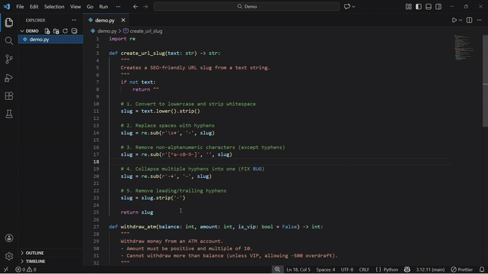

# LocalUnit 🛡️
> **AI Unit Test Generator. 100% Local. 100% Privacy.**

**LocalUnit** is the ultimate VS Code extension for developers who value privacy and speed. It helps you generate comprehensive, edge-case-covering Unit Tests for **Python**, **Java**, and **JavaScript/TypeScript** directly inside your editor. 

Unlike other AI tools, **LocalUnit** runs entirely on your machine using local LLMs (via Ollama). No API keys required. No code ever leaves your computer.

---

## 🔥 Key Features

* **🔒 Privacy First:** Your code never leaves your machine. Perfect for enterprise environments, NDAs, and sensitive projects.
* **💸 Free Forever:** Runs on your own hardware using Ollama. Say goodbye to monthly AI subscriptions.
* **🧠 Context Aware:** LocalUnit doesn't just look at the function; it intelligently reads your file's **imports**, **class definitions**, and **dependencies** to write accurate, runnable tests.
* **⚡ Smart Append:** Automatically detects existing test files (e.g., `test_utils.py` or `utils.test.js`). It appends new tests to the existing file instead of creating messy duplicates.
* **🌊 Streaming Output:** Watch the test code being generated in real-time with a beautiful streaming UI, just like GitHub Copilot.
* **🛠️ Multi-Language Support:**
    * 🐍 **Python:** `unittest`, `pytest`
    * ☕ **Java:** `JUnit 5`, `TestNG`
    * 🌐 **JavaScript/TypeScript:** `Jest`, `Mocha`, `Vitest`

---

## 🚀 Getting Started

Follow these simple steps to turn your machine into a testing powerhouse.

### 1. Prerequisites
Ensure you have the following installed:
* [VS Code](https://code.visualstudio.com/) (version 1.80.0 or higher)
* [Ollama](https://ollama.com/) (must be running in the background)

### 2. Install & Run Ollama
Download and install Ollama for your operating system (macOS, Linux, or Windows). Once installed, open your terminal and pull a coding-capable model. 

We highly recommend `qwen2.5-coder` for speed or `mistral` for logic.

~~~bash
# Pull the model (do this once)
ollama pull qwen2.5-coder

# Start the server (if not running)
ollama serve
~~~

### 3. Usage
1.  Open any Python, Java, or JS/TS file in VS Code.
2.  **Highlight** the specific function, method, or class you want to test.
3.  Right-click the selection and choose **"LocalUnit: Generate Unit Test"**.
4.  Sit back! LocalUnit will find the appropriate test file (or create one) and write the test cases for you.

---

## ⚙️ Configuration

You can fine-tune LocalUnit to fit your workflow via VS Code Settings (`Cmd + ,` -> Search `LocalUnit`).

| Setting | Default | Description |
| :--- | :--- | :--- |
| `localunit.model` | `qwen2.5-coder` | The exact model name to use in Ollama. Ensure you have pulled this model via terminal. |
| `localunit.temperature` | `0.2` | Controls the "creativity" of the AI. Lower values (0.1-0.3) produce more deterministic and correct code. |
| `localunit.apiBase` | `http://localhost:11434` | The URL where your local Ollama instance is running. |
| `localunit.autoImport` | `true` | If enabled, the AI will attempt to automatically generate import statements for the tests. |

---

## ❓ Troubleshooting

**Q: I get a "Connection Refused" error.**
> **A:** Make sure Ollama is actually running. Open a terminal and type `ollama list` to verify it's active. By default, it runs on port `11434`.

**Q: The generated code cuts off in the middle.**
> **A:** This might happen with smaller models. Try increasing the context window or switching to a more robust model like `qwen2.5-coder` or `llama3`.

**Q: It says "Model not found".**
> **A:** Check your settings (`localunit.model`). The name there must match exactly what you see when you run `ollama list` in your terminal.

---

## 🗺️ Roadmap

* [ ] Support for C# and Go.
* [ ] "Refactor Code" command.
* [ ] Chat interface to ask questions about the selected code.
* [ ] One-click "Run Generated Test" button.

---

## 🤝 Contributing

Contributions are welcome! If you'd like to improve LocalUnit, please fork the repository and submit a Pull Request.

1.  Fork the Project
2.  Create your Feature Branch (`git checkout -b feature/AmazingFeature`)
3.  Commit your Changes (`git commit -m 'Add some AmazingFeature'`)
4.  Push to the Branch (`git push origin feature/AmazingFeature`)
5.  Open a Pull Request

## 📄 License

Distributed under the MIT License. See `LICENSE` for more information.

---
*Made with ❤️ by Kim*
